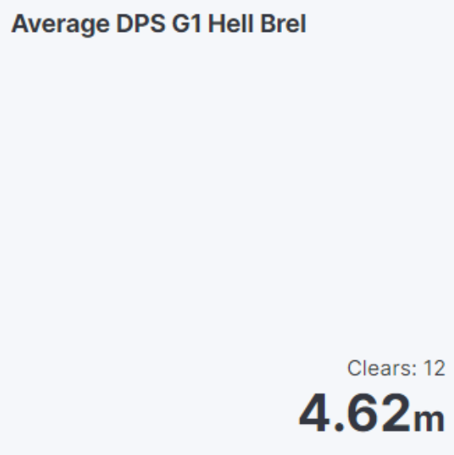

# LA Tracker

Script which indexes your LOA logs data from your .db file into elasticsearch.

If you want to get started locally, you can take a look at running https://github.com/deviantony/docker-elk which starts up both Elasticsearch and Kibana.

Supply your credentials of your elasticsearch instance within .env ELASTICSEARCH_ENDPOINT and ELASTICSEARCH_KEY.

Future plans are to add a way to parse it such you can use data from specific times in the raid.

With the data provided, you can make some basic visualizations in Kibana:

